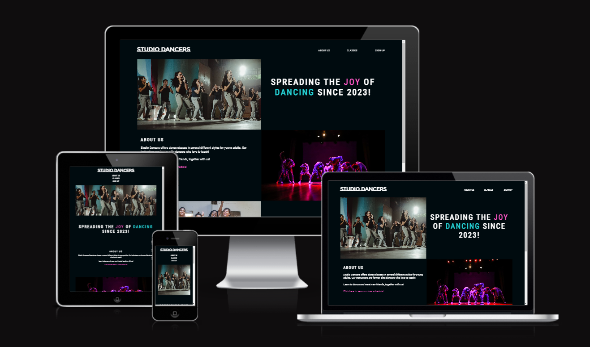
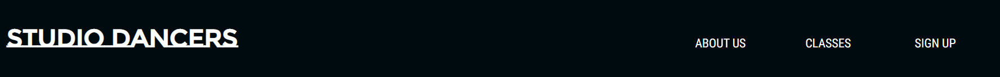
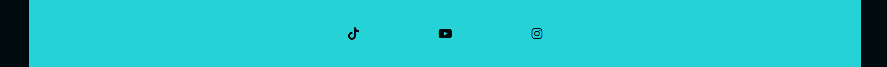
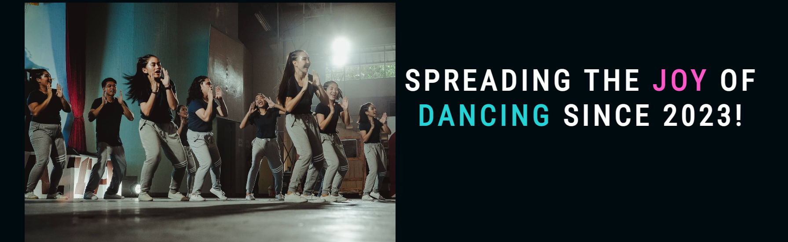
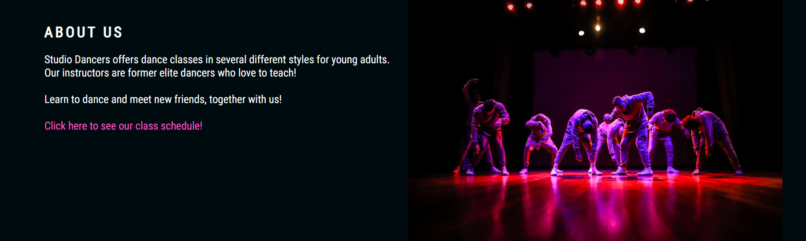
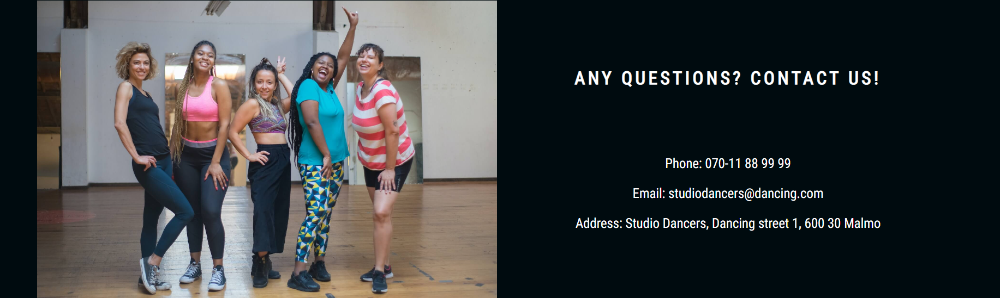
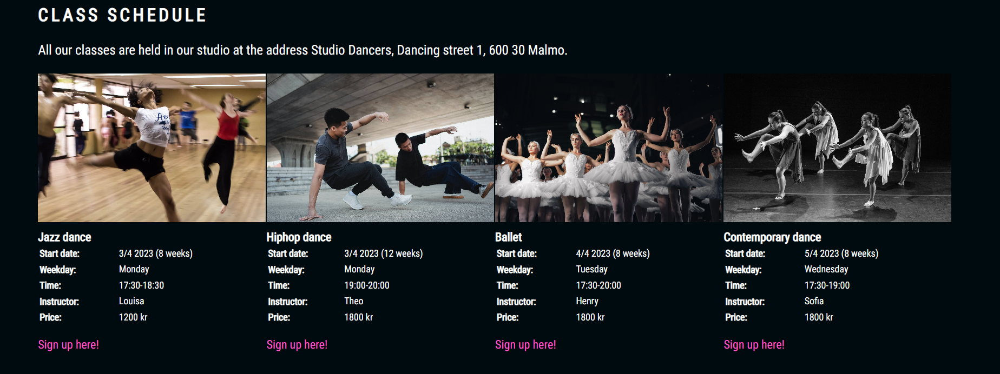
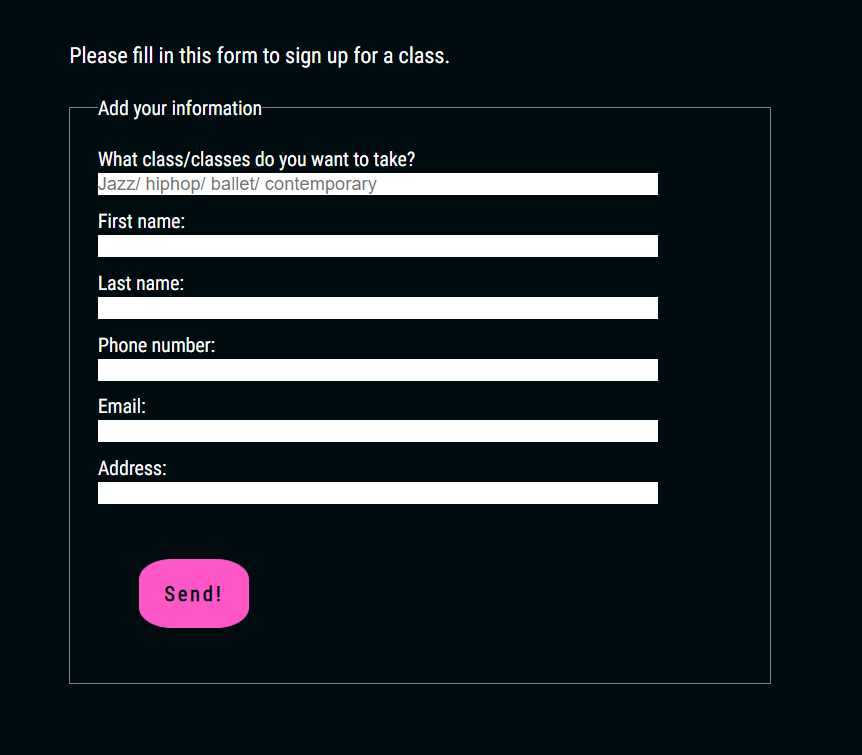
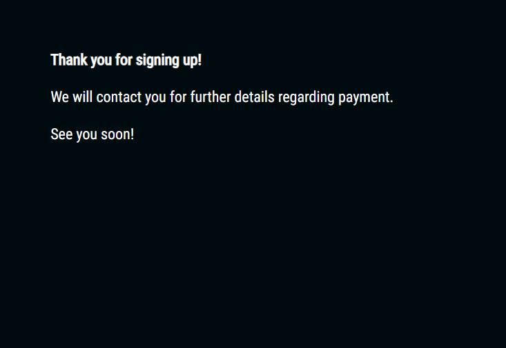
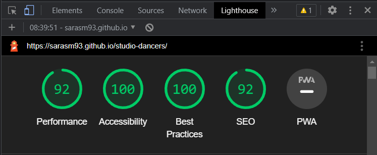

# **Studio dancers**

Studio dancers wants to spred the joy of dancing! By offering dance classes in several different styles with high class instructors for young adults, the Studio Dancers site hopes to get more young people to stay active by discovering and stay in the amazing world of dance! It is targeted towards those how wants to start dancing and those who already love to dance to make them want to keep dancing! The site is useful for those who want to take a dance class, get information about which classes are offered, where and when they are held, price, etc. and register for a class.

You can find the site [here.](https://sarasm93.github.io/studio-dancers/)

## **Features**
---

### **Features relevant to all pages**

#### **Header**

Contains the logo and navigation bar and is located at the top of every page where the user would expect them to be. The logo and navigation bar together give the user the name of the site and where different information can be found. The header provides links to all pages of the site to easily navigate between them. The logo is a link to the home page and the navigation bar links to the other pages; Classes and Sign up.  

The links turn pink or blue when hovering over them, indicating to the user that the object is clickable. 

#### **Footer**

The footer is located at the bottom of every page. It contains icons with links to external social media pages which is useful to the user in order to get even more interesting information about what Studio dancers offers. It has therefore been given a bright blue color to make it stand out from background color of the rest of the site, to be easily found and to not be forgotten.

The links are opened in a new tab, so that the user can stay on the Studio dancers site. 

### **The Home page**

#### **The Introduction section**

This section aims to give the user a warm welcome and is useful to the users as it gives them a first glance of what dancing at Studio dancers could look like. It aims to make them interested and to make them want to continue exploring the page. This is done with a happy image and inspirational and selling words. Words that I want the user to focus on are highlighted with pink and blue color. 

The image has been placed to the left to make it appear directly under the logo and navigation bar on smaller screens.  

#### **The About us section**

The About us-section provides the user a little bit more detailed information about what Studio dancers offers that is useful for the to know what they can expect if they sign up for a class. Directly below the information a link is provided to the schedule for the dance classes, so that the user can reach it fast and easy without having to go to the navigation bar again. The link is highlighted in pink and changes to white when hovering over it. 

#### **The Contact section**

The contact section lets the user know that questions can be asked if needed and provides the user with a phone number, email address and street address which the user is encuraged to use if there are any questions. To make it as useful as possible for the user, the contact details is provided on the home page so that the user early on in its journey at the site knows that questions can be asked if needed.   

### **The Classes page**

The classes page is useful to the user as it provides important information about all the dance classes in order for the user to know what to sign up for. It contains information about where the classes are held; what dance styles Studio dancers offers classes in; when and how many weeks the classes are held; names of the instructors and prices for the classes. Above the text information about each dance style there is an image showing dancers dancing that specific style. Below the text information for each style there is a link to the sign up page. The link is placed there, and also highlighted in pink, to make it very easy for the user to find the form. The links turns white when hovering over them.  

### **The Sign up page**

This page is useful to the user as it makes it possible to sign up for classes. The page provides a form with a submit button in the end, that collects the details needed to sign up; choice of class and contact details. The submit button is highlighted in pink to try to remind the user to not forget to send the form. The buttons becomes white when hovering over it.     

### **The Thank you page**

The purpose and value of the thank you-page is simply to ensure the user that the form has been sent and inform them that Studio dancers will contact them. It only contains a few short sentences, to not keep the user at this page longer than necessary. 

### **Future features**

- A news or calender section at the home page showing what events the dancers will attend soon. 
- Add a gallery to show how what a great dancer the user can be and how fun the user can have with Studio dancers. 

## **Testing**
---

The [WebAIM Contrast checker](https://webaim.org/resources/contrastchecker/) has been used to test that the contrast between the colors used is sufficient. At first, the pink color didn´t pass one of the tests for normal sized text. I changed the color to a slightly brighter one, then all colors passed all tests.   

The site has been tested so that it works on different browsers. It has been tested on Google Chrome, Microsoft Edge, Firefox and Samsung Internet. 

I have confirmed that the links on the site are not broken and works as intended and that all text is readable. 

I have also checked that the form on the sign up page is validated.

I have used [Responsinator](http://www.responsinator.com/) and the DevTools toolbar to test responsiveness and make the site look good on different screen sizes. 

Git was used for version control. Gitpod was used to write the code and the site was continuously preview using DevTools. 

### **Validator testing**

I have validated my code with the below websites. 
- HTML: [W3C Markup Validation Service](https://validator.w3.org/#validate_by_input) 
- CSS: [W3C CSS Validation Service](https://jigsaw.w3.org/css-validator/#validate_by_input)

When validating classes.html there was errors regarding missing elements for the table. It also gave a warning regarding that sections should have headings. The code was missing some `<tr>` and `</tr>` elements which were added to solve the errors, and `<h2>` and `<h3>` elements were added to the sections.

When validating signup.html there was an error about a label in the form, saying "the value of the for-attribute of the label element must be the ID of a non-hidden form control". I had used a for-attribute that didn´t match the ID on the input element. I changed the for-attribute to match the ID and the error was solved. The validation also gave a warning about the usage of a caption element. The caption element was removed as I realised it was wrongly used on a form element. This solved the error.

When validating style.css there were four warnings saying that font family names that contain spaces must be entered in quotation marks. I noticed quotations marks were missing for the montserrat subrayada and roboto condensed fonts and added this to solve the warning.

The deployed site returns no errors when validated. 

I also checked the accessibility of the site with Lighthouse in DevTools. The results for the final page is shown below. The first time I checked the accessibility, the score was lower than shown below. I increased the score by using compressed images that made the site load faster. I also added aria-labels to the images on the classes page and the logo and navigation bar. 

### **Resolved problems**

In order to get the navigation bar to stay in the far right corner of the site header, and be displayed in the right order without having to change the order of the navigation items in the .html files, I used the grid view concept. I used divs and column widths instead of a list in order to align the items on larger screens. The empty paces between the navigation bar and the logo was created with empty divs with column widths. For smaller screen sizes the empty divs was given a value 0 for the width, so that the navibation bar would be placed in the middle of the screen. The same principle was applied in order to align and center the icons in the footer.

I also wanted to vertically align the logo and the navigation bar so that the bottom of the text was on the same horizontal line. To solve this margin was added to the top of the paragraph elements in the navigation bar. 

I had trouble finding the best way to vertically align text at the home page, so that it would be centered relative to an image. I tried using line-heigt but that would give the text very large spacing at small screen-sizes when the text needs several rows. Instead I solved it with using top margins on the text elements.  

I had trouble with how to define both a min- and a max-screen size in a media query. After some research I solved it by adding the word 'only' to the syntax of the media query and then use both a min- and a max-size, like this: `@media only screen and (min-width: 320px) and (max-width: 480px)`.

I also had trouble with images not displaying when using grid view. I solved it by adding height property directly on the image divs.

### **Resolved Bugs**

When testing the site in different browsers I saw a dark thin line across the footer and a blue thin line right below the footer. I located the lines to be borders of elements within the footer and solved it be giving blue background color and increasing the line-height to divs in the footer. 

When testing responsiveness, large gaps appeared for the smaller screen sizes between the information about the different classes. The problem was due to heights for the divs containing the information having vh-values. To solve it I gave only the biggest screen sizes a vh-value and the smaller once a px-value. 

After adding aria-labels to the images at the classes page, testing the website again showed me that the labels was incorrectly added. This was solved by adding a role-attribute to the divs where the aria-label was added. 

No bugs have been idenitified in the deployed version.

## **Deployment**
---
You can find the link to the live site [here.](https://sarasm93.github.io/studio-dancers/)

The site was deployed to Github Pages with the following three steps:

1. Log on to GitHub
2. Find the correct repository 
3. Find the settings tab in the repository navigation bar
4. Find the pages option in the bar on the right hand side
5. In the branch drop-down menu select the main branch
6. Click the save button
7. The site is published and the URL for it is now provided in the bar directly under the GitHub Pages. If the URL is not provided directly you might need to refresh the page in order for it to show.

## **Credits**
---
### **Content and design**

Code from [W3Schools website section about grid view](https://www.w3schools.com/css/css_rwd_grid.asp) has been used in the style.css file to create a grid with columns and make the Studio dancers site responsive. Comments have been added in the code to show where the borrowed code is.

In order to increase the accessibility score for the page I had to add aria-labels to the images at the classes page. In order for the syntax to be correct (by adding a role-attribute) I used this [W3SC website](https://www.w3.org/TR/html-aria/#docconformance-naming) to guide me. 

I used from [W3C website](https://www.w3schools.com/cssref/pr_background-image.php) and [the Medium website](https://medium.com/@kimcodeashian/simple-css-solutions-how-to-resize-images-with-different-dimensions-without-cropping-eb744e93246d) to guide me regarding how to display and size images displayed with css background selectors instead of an html image element was used. 

In order to understand how media queries work and how to create a query that defines both a min- and a max-size, I have looked at [W3Schools website](https://www.w3schools.com/css/css3_mediaqueries_ex.asp) and [Stack overflow](https://stackoverflow.com/questions/63810344/how-to-use-multiple-media-queries-in-a-single-css-file). 

I used [W3Schools website](https://www.w3schools.com/css/css_align.asp) to better understand how to vertically align text, in my case relative to an image. The site gave me the tools the help move content up and down by adding margins.  

Information to guide me regarding how to [build forms](https://www.w3schools.com/html/html_forms.asp) and what [different input types](https://www.w3schools.com/html/html_form_input_types.asp) that are available to create a valid sign up form was used from the W3Schools website and from [Mozilla´s website](https://developer.mozilla.org/en-US/docs/Learn/Forms/Form_validation). I also used [Aditus website](https://www.aditus.io/aria/aria-label/) and [W3Cs website](https://www.w3.org/WAI/ARIA/apg/patterns/landmarks/examples/form.html) to understand how to add a aria-label and aria-labelledby attribute to a form. 

[The css-ticks site](https://css-tricks.com/multiple-class-id-selectors/) was used to understand and create a selector that targets a class under another class.  

In order to get started with the coding of the site, I used the '!+tab' command to create a boilerplate html structure. I also used [Love Running lessons](https://learn.codeinstitute.net/courses/course-v1:CodeInstitute+LR101+2021_T1/courseware/4a07c57382724cfda5834497317f24d5/f2db5fd401004fccb43b01a6066a5333/) to get ideas on what to start with. 

I have used this [dance studio web theme](https://themeforest.net/item/dance-studio-wordpress-theme/20555996) and this [Vibez web theme](https://themeforest.net/item/vibez-a-dynamic-multiconcept-theme-for-dance-studios-and-instructors/19654985) at [Themeforest](https://themeforest.net/), along with the website for [Rydbergs dance academy](https://rydbergsdance.com/) as inspiration for the design and layout of the page. 

[Google Fonts](https://fonts.google.com/) was used to import 'Montserrat subrayada' and 'Roboto condensed' fonts and [Font Awesome](https://fontawesome.com/) was used to import icons. 

The [Love Running lessons](https://learn.codeinstitute.net/courses/course-v1:CodeInstitute+LR101+2021_T1/courseware/4a07c57382724cfda5834497317f24d5/e6d4cda2bc08458ba94d2092be9bad3a/?child=first) was used to get the structure of the footer with icons and anchor elements with the right attributes in place on my website. When this was in place I used divs and column widths instead of a list in order to align the icons and to make the footer responsive. 

[Fontpair](https://www.fontpair.co/all) was used to try to find fonts that look good together. 

[Adobe color](https://color.adobe.com/sv/create/color-wheel) was used to try to find colors that gives a good feeling to the site.  

The readme.md files for the [Love running website](https://github.com/Code-Institute-Solutions/readme-template), the [Coding club website](https://learn.codeinstitute.net/courses/course-v1:CodeInstitute+CSSE_PAGPPF+2021_Q2/courseware/66cf361c769a41d496f5001fae6f9be7/3b5cd5dc8313462aa5975a3c9b9a1a3c/) and [Angie´s Beauty website](https://github.com/AmyOShea/Angies-Beauty-MS1) has been used for inspiration for the content of the readme.md file for this site.

### **Images**

The images used on the site have been taken from [Unsplash](https://unsplash.com/) and [Pexels](https://www.pexels.com/sv-se/). The specific links to each image are listed below.

Unsplash:
- [happy-group-medium.jpg](https://unsplash.com/photos/GRDpPpKczdY)
- [stage-group-medium.jpg](https://unsplash.com/photos/_v8C6BlpBzY)
- [ballet-medium.jpg](https://unsplash.com/photos/nZU76qWy-T8)
- [contemporary-medium.jpg](https://unsplash.com/photos/n-g7dgwNZg4)

Pexels:
- [five-girls-medium.jpg](https://www.pexels.com/sv-se/foto/vanner-kvinnor-kondition-traning-8957649/)
- [jazz-medium.jpg](https://www.pexels.com/sv-se/foto/manniskor-dans-sport-rorlig-12312/)
- [hiphop-medium.jpg](https://www.pexels.com/sv-se/foto/gata-man-rorelse-ung-5368956/)

[Tinypng](https://tinypng.com/) was used to compress the images.

## **Acknowledgments**
---

I want to thank my mentor Antonio Rodriguez for guiding me when building this site to make it responsive with grid view.

